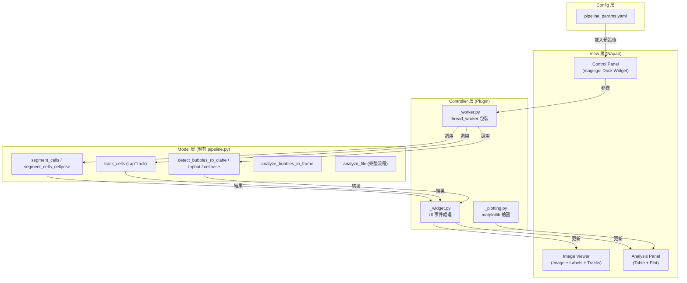

# 專案代號：Cell-Vacuole-Tracker (Napari Plugin)

> **整合版藍圖** — 基於現有 `pipeline.py`（1293 行、46 個函數）與 `pipeline_params.yaml` 配置系統重新設計，避免重複造輪子。

---

## 0. 核心架構視圖



**關鍵設計原則**：Plugin 層只做 UI 包裝，所有科學運算由現有 `pipeline.py` 提供。

---

## 1. 可直接復用的現有函數

在開始寫 Plugin 之前，確認這些函數**不需要重寫**：

| 功能 | 現有函數 | 所在位置 |
|------|---------|---------|
| 影像載入 | `load_tiff(filepath)` | pipeline.py:206 |
| 影像正規化 | `normalize_frame(frame)` | pipeline.py:216 |
| 傳統分割 | `segment_cells(imgs)` | pipeline.py:231 |
| Cellpose 分割 | `segment_cells_cellpose(imgs)` | pipeline.py:335 |
| 細胞追蹤 | `track_cells(masks)` | pipeline.py:572 |
| 泡泡偵測 (rb_clahe) | `detect_bubbles_rb_clahe(mask, img)` | pipeline.py:771 |
| 泡泡偵測 (tophat) | `detect_bubbles_tophat(mask, img)` | pipeline.py:728 |
| 泡泡偵測 (Cellpose) | `detect_bubbles_cellpose(mask, img)` | pipeline.py:824 |
| 逐幀泡泡分析 | `analyze_bubbles_in_frame(mask, img)` | pipeline.py:878 |
| 完整分析流程 | `analyze_file(filepath, ...)` | pipeline.py:996 |
| QC 圖層生成 | `create_qc_overlay(img, mask, idx)` | pipeline.py:1127 |
| 追蹤指標計算 | `compute_tracking_metrics(track_df)` | pipeline.py:368 |

---

## 2. 分階段實作藍圖

### Phase 1: 基礎骨架與單幀測試

**目標：** 建立 Plugin 骨架，在 Napari 中調參並即時看見分割 + 泡泡偵測結果。

* **功能檢核點：**
  * [ ] 建立 `src/napari_plugin/` Package 結構
  * [ ] 實作右側 Dock Widget (`magicgui`)，分為三個區塊：
    * **分割參數面板**：
      * 分割方法下拉選單 (`cellpose` / `watershed`)，對應 YAML 的 `segmentation.method`
      * Cellpose: `diameter`, `cellprob_threshold`, `flow_threshold`
      * Watershed: `gaussian_sigma`, `min_cell_area`, `peak_min_distance`
    * **泡泡偵測參數面板**（⚠️ 本專案核心特色）：
      * 偵測方法下拉選單 (`rb_clahe` / `tophat` / `cellpose`)
      * `thresh`, `clahe_clip`, `min_area`, `max_area`, `min_circularity`
    * **執行按鈕區**：`Test Current Frame` / `Run Full Video`
  * [ ] 所有參數初始值從 `config/pipeline_params.yaml` 載入
  * [ ] 實作 **"Test Current Frame"** 按鈕：
    * 使用 `@thread_worker` 避免 UI 凍結
    * 調用 `segment_cells()` 或 `segment_cells_cellpose()` → 顯示 Cell Labels
    * 調用 `detect_bubbles_rb_clahe()` → 顯示 Bubble Labels
  * [ ] 實作圖層管理邏輯（更新而非重複新增）

```python
# _worker.py 核心邏輯示意
from napari.qt.threading import thread_worker
from src.pipeline.pipeline import (
    segment_cells, segment_cells_cellpose,
    detect_bubbles_rb_clahe, normalize_frame,
    load_config, CONFIG
)

@thread_worker
def run_single_frame(frame, method='cellpose', bubble_method='rb_clahe', **params):
    """在背景執行緒中運行分割 + 泡泡偵測"""
    # 1. 載入配置
    load_config()

    # 2. 細胞分割
    if method == 'cellpose':
        masks = segment_cells_cellpose(frame[np.newaxis, ...])[0]
    else:
        masks = segment_cells(frame[np.newaxis, ...])[0]

    # 3. 泡泡偵測
    bubble_labels = detect_bubbles_rb_clahe(masks, normalize_frame(frame))

    yield masks, bubble_labels  # 回傳給 UI 更新
```

---

### Phase 2: 批次處理與追蹤視覺化

**目標：** 處理完整影片，將現有 LapTrack 追蹤結果顯示在 Napari Tracks Layer。

> ⚠️ 追蹤邏輯已在 `track_cells()` 實作完成，本階段重點是**視覺化整合**。

* **功能檢核點：**
  * [ ] 實作 **"Run Full Video"** 按鈕
  * [ ] 加入 **Progress Bar**（連結 `worker.yielded` 信號）
  * [ ] 批次分割：逐幀調用分割函數，組裝為 `(T, Y, X)` Label Array
  * [ ] 調用 `track_cells(masks)` 獲取 `track_df`
  * [ ] 將 `track_df` 轉換為 Napari Tracks 格式：

    ```python
    # track_df 已有 [frame, tracked_id, y, x]
    tracks_data = track_df[['tracked_id', 'frame', 'y', 'x']].values
    viewer.add_tracks(tracks_data, name='Cell Tracks')
    ```

  * [ ] 逐幀泡泡偵測：對每幀調用 `analyze_bubbles_in_frame()` 並累積結果
  * [ ] 輸出 Cell Labels `(T, Y, X)` + Bubble Labels `(T, Y, X)` 到 Napari

---

### Phase 3: 數據關聯與分析表格

**目標：** 建立 Cell-Vacuole 父子關係，生成分析表格。

> ⚠️ `analyze_bubbles_in_frame()` 已計算每個細胞的泡泡數量與面積，可直接使用。

* **功能檢核點：**
  * [ ] **父子映射**：已在 `analyze_bubbles_in_frame()` 內部實現（泡泡按所屬細胞 label 歸類）
  * [ ] **Master DataFrame 生成**：

    ```python
    # Columns: Time, Tracked_Cell_ID, Cell_Area, Bubble_Count,
    #          Total_Bubble_Area, Bubble_Ratio, Mean_Intensity
    ```

  * [ ] 使用 `merge_track_labels()` 將 tracked_id 對應到泡泡數據
  * [ ] 將 DataFrame 顯示在下方 Widget（使用 `QTableView` 或 `napari-skimage-regionprops`）
  * [ ] 支援 **CSV 匯出按鈕**

---

### Phase 4: 互動與視覺化（錦上添花）

**目標：** 實現「點哪裡、看哪裡」的絲滑體驗。

* **功能檢核點：**
  * [ ] **事件監聽**：綁定 `labels_layer.events.selected_label`
  * [ ] **點擊細胞顯示資訊**：
    * 該細胞的追蹤 ID 與所在時間點
    * 泡泡數量、總面積、佔比
    * 時間序列圖（Time vs Bubble Count / Area）
  * [ ] **表格↔畫面雙向連動** (Optional)：
    * 點表格某一行 → Viewer 跳轉到對應 Frame 並 Highlight 該細胞
    * 點畫面上的細胞 → 表格自動捲動到對應行
  * [ ] **「Save Parameters」按鈕**：將目前 UI 上的參數回寫到 `pipeline_params.yaml`

---

## 3. 技術注意事項

### A. UI 執行緒阻塞（最重要）

* **規則**：任何超過 0.1 秒的運算都必須用 `@thread_worker`
* **影響範圍**：Cellpose 推論、整段影片處理、泡泡偵測批次處理

### B. 記憶體管理

* **小數據集**（< 50 幀）：直接用 Numpy In-Memory
* **大數據集**（> 100 幀）：用 `dask.array` + Zarr 做 Lazy Loading
* **建議**：Phase 1-2 先用 Numpy，遇到瓶頸再切換

### C. 配置系統整合

```python
# _widget.py 中載入配置作為預設值
from src.pipeline.pipeline import load_config, CONFIG

load_config()  # 載入 pipeline_params.yaml

# magicgui widget 的預設值直接取自 CONFIG
cellpose_diameter = CONFIG['cellpose']['diameter']          # 100
bubble_thresh = CONFIG['bubble']['rb_clahe']['thresh']      # 0.28
bubble_clahe = CONFIG['bubble']['rb_clahe']['clahe_clip']   # 0.5
```

### D. 圖層管理最佳實踐

```python
def update_or_create_layer(viewer, data, name, layer_type='labels'):
    """更新已存在的圖層，或建立新圖層"""
    existing = [l for l in viewer.layers if l.name == name]
    if existing:
        existing[0].data = data
    else:
        if layer_type == 'labels':
            viewer.add_labels(data, name=name)
        elif layer_type == 'image':
            viewer.add_image(data, name=name)
```

---

## 4. 專案檔案結構

```text
Cell-Vacuole-Tracking/
│
├── config/
│   └── pipeline_params.yaml        # 統一配置（已有）
│
├── src/
│   ├── pipeline/
│   │   └── pipeline.py             # 後端核心（已有，1293 行）
│   │
│   ├── napari_plugin/              # 【新建】Napari Plugin
│   │   ├── __init__.py             # Plugin 入口 & napari.yaml 設定
│   │   ├── _widget.py              # magicgui 介面定義
│   │   ├── _worker.py              # thread_worker 背景運算
│   │   ├── _analysis.py            # DataFrame 整合 & 表格顯示
│   │   ├── _plotting.py            # matplotlib 時間序列圖
│   │   └── _layer_utils.py         # 圖層管理工具
│   │
│   └── tests/                      # 測試工具（已有）
│       ├── param_sweep.py
│       ├── bubble_param_sweep.py
│       └── ...
│
└── pyproject.toml                  # 新增 napari plugin entry point
```

---

## 5. 環境設定

> ⚠️ 本專案使用 **`uv`** 管理依賴（非 conda）

```bash
# 安裝 Napari Plugin 開發依賴
uv add "napari[all]" magicgui qtpy superqt

# 安裝 Plugin 為可編輯模式（開發用）
uv pip install -e .

# 啟動 Napari
uv run napari
```

**pyproject.toml 新增 Plugin 入口**：

```toml
[project.entry-points."napari.manifest"]
cell-vacuole-tracker = "src.napari_plugin:napari.yaml"
```

---

## 6. 開發優先順序與時程建議

| 階段 | 預估工時 | 優先級 | 依賴 |
|------|---------|--------|------|
| Phase 1: 單幀測試 | 2-3 天 | 🔴 必做 | 無 |
| Phase 2: 批次處理 | 2-3 天 | 🔴 必做 | Phase 1 |
| Phase 3: 數據表格 | 2-3 天 | 🟡 重要 | Phase 2 |
| Phase 4: 互動連動 | 1-2 天 | 🟢 錦上添花 | Phase 3 |

**總計：約 7-11 天**

---

## 7. 下一步行動

建議從 **Phase 1** 開始，先完成最小可用原型：

1. **建立 `src/napari_plugin/` 骨架**：`__init__.py` + `_widget.py` + `_worker.py`
2. **實作 Test Current Frame**：在 Napari 中看到分割 + 泡泡偵測結果
3. **驗證 thread_worker**：確保 UI 不會凍結

完成後即可在 Napari 中互動式調參，取代目前的命令列工作流。
